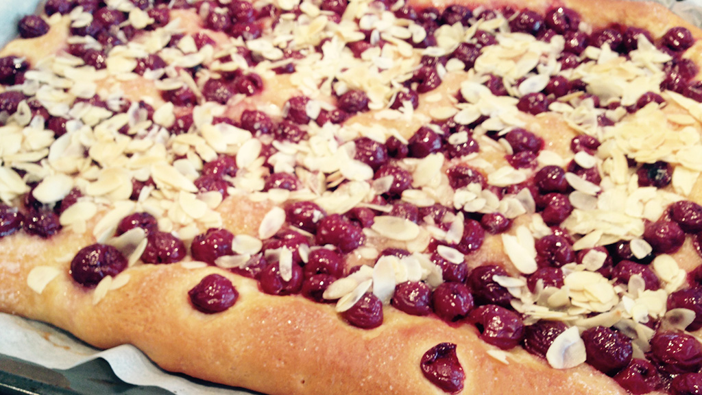

## Zutaten
- *500 g*	 Mehl
- *1 Prise* Salz
- *1 Päckchen* Vanille-Zucker
- *100 g + 75 g* Zucker
- *1 Beutel* Trockenhefe
- *75 g + 100 g* Butter/Margarine
- *¼ Liter* Milch
- *1* Ei (Gr. M)
- *2 Gläser* Kirschen (à 720 ml)
- * * Fett fürs Backblech
- *200 g* Mandelstifte

## Zubereitung
1. Mehl, Salz, Vanille-Zucker, 100 g Zucker und Hefe vermengen. 75 g Butter schmelzen, Milch zugießen. Mit dem Ei zum Mehl geben und alles zu einem glatten Teig verkneten.  Zugedeckt an einem warmen Ort ca. 45 Minuten gehen lassen.
2. Kirschen gut abtropfen lassen. Teig durchkneten und auf einem gefetteten Backblech ausrollen. Kirschen gleichmäßig auf dem Teig verteilen und mit 75 g Zucker bestreuen. Nochmals ca. 15 Minuten gehen lassen.
3. Den Kuchen im vorgeheizten Backofen (E-Herd: 200°C/Umluft: 175°C) ca. 10 Minuten vorbacken.
4. 100 g kalte Butter würfeln. Mit den Mandelstiften auf dem Kuchen verteilen und weitere ca. 15 Minuten fertig backen. Kuchen abkühlen lassen.