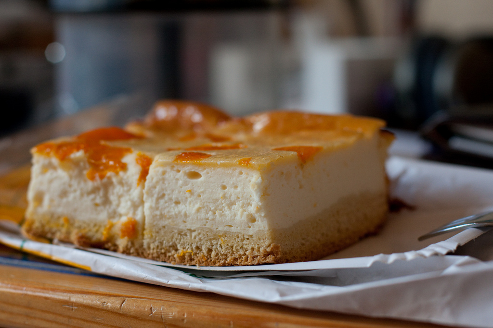

## Zutaten

Für den Mürbeteig:

* *125 g* Mehl
* *65 g* Zucker
* *65 g* Margarine oder Butter
* *1* Ei
* *1 TL* Backpulver

Für die Füllung:

* *500 ml* Milch
* *2 Pck.* Puddingpulver, Vanille
* *200 g* Zucker
* *3 Becher* Schmand
* *2 Dosen* Mandarinen
* *1 Pck.* Tortenguss, klar

## Zubereitung

1. Den Pudding kochen (Milch, Puddingpulver und Zucker). Zum Abkühlen zur Seite stellen.
2. Danach die Mandarinen abtropfen lassen.
3. Für den Boden die Zutaten zusammenkneten. Er kommt in eine gefettete Springform, auch einen Rand hochziehen.
   Wenn es ein *Blechkuchen* werden soll: die Mengenangaben für den Teig verdoppeln.
4. Der Schmand wird mit dem abgekühlten Pudding verrührt (ohne Haut) und auf dem Boden verteilt. Die Mandarinen werden auf die Schmand-Puddingmasse dekoriert.

Der Kuchen wird bei 175°C für etwa 80 Minuten gebacken.
Wenn der Kuchen erkaltet ist, mit Tortenguss überziehen.